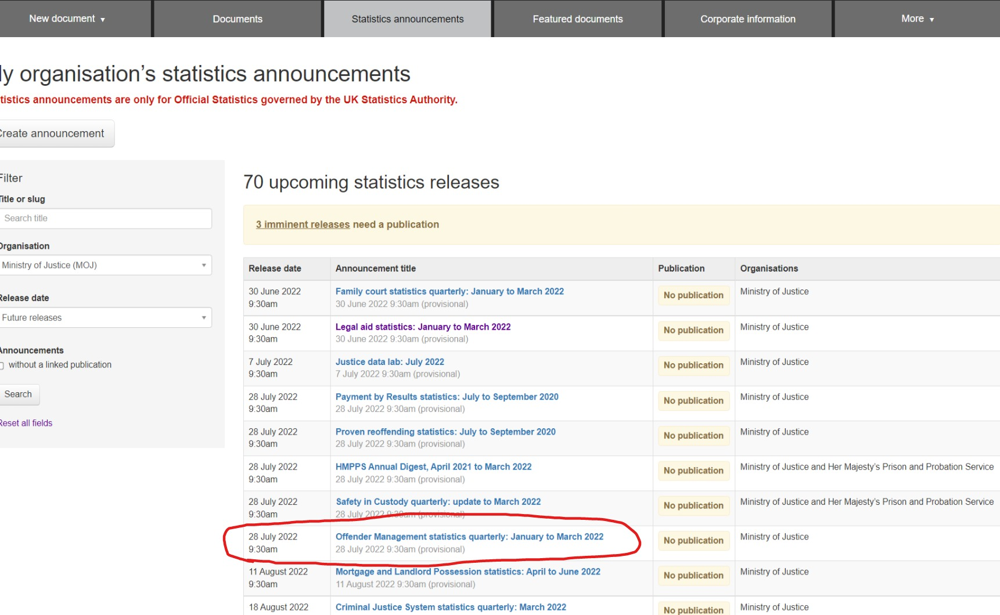

## How to create a HTML attachment on Whitehall 

An example of a statistical report in HTML format (Offender Management Statistics Quarterly) can be seen [here](https://www.gov.uk/government/statistics/offender-management-statistics-quarterly-july-to-september-2021)

To attach an HTML report to a statistical announcement follow the steps outlined below.

**Step 1**: Within the ‘Statistics announcements’ tab, find and click on the relevant publication 

In order to attach an HTML report you will first need to create and save a draft document. To do so follow the stages below.