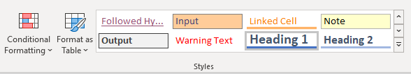
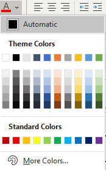
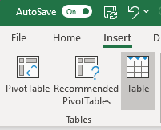
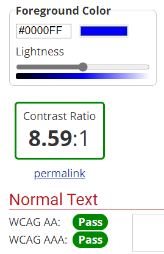

# Introduction

Accessibility is an important consideration in the creation of spreadsheets, such as those which contain data tables to accompany statistical publications. Since 2020 it has been a requirement for all information published online by public sector bodies to comply with accessibility regulations.

This guidance aims to help statistics producers to get started on making their publications accessible as quickly and easily as possible. It should be read in conjunction with the more comprehensive GSS Guidance below:

[Releasing statistics in spreadsheets – GSS](https://gss.civilservice.gov.uk/policy-store/releasing-statistics-in-spreadsheets/)

[Making spreadsheets accessible: a checklist of the basics – GSS](https://gss.civilservice.gov.uk/policy-store/making-spreadsheets-accessible-a-brief-checklist-of-the-basics/)

# Why we need to produce accessible spreadsheets

The GSS Best Practice and Impact Division team have [outlined three reasons](https://gss.civilservice.gov.uk/policy-store/accessibility-legislation-what-you-need-to-know/) why accessibility is important and why we need to follow it.

1.	[The Code of Practice for Statistics](https://code.statisticsauthority.gov.uk/the-code/value/v2-accessibility/) states:

> “The needs of different types of users and potential users should be considered when determining ways of presenting and releasing the statistics and data”

> “The needs of people with disabilities must be considered. Statistics and data should be released using accessible communication formats and means which should work with the most commonly-used assistive technologies”

2.	the UK legislation [Public Sector Bodies (Websites and Mobile Applications) Accessibility Regulations 2018](https://www.legislation.gov.uk/uksi/2018/852/introduction/made) states: “public sector bodies must comply with the accessibility requirement”, where ‘accessibility requirement’ means the requirement to make a website or mobile application accessible by making it perceivable, operable, understandable and robust – this aligns with the [Web Content Accessibility Guidelines (WCAG) 2.1](https://www.w3.org/TR/WCAG21/) at the AA standard.

3.	[The Equality Act 2010](https://www.legislation.gov.uk/ukpga/2010/15/contents) (or the [Disability Discrimination Act 1995](https://www.legislation.gov.uk/ukpga/1995/50/contents) in Northern Ireland) states that all UK service providers must consider ‘reasonable adjustments’ for disabled people.

# Options for creating accessible spreadsheets

GSS guidance includes [a demonstration of how to make a spreadsheet accessible](https://gss.civilservice.gov.uk/policy-store/releasing-statistics-in-spreadsheets/#section-5)

The guidance produced here aims to provide a step-by-step guide of the most essential stages in this process to help producers get started. Note that this guidance does not cover every stage in making a spreadsheet accessible. These are covered in full in the GSS Guidance.

Producers should also note that it is the final output that is important for meeting accessibility regulations. How this is achieved is up to producers. In addition to following the GSS demonstration, we have presented two options for how to do this here.

## Use an R package to output a series of R data frames as an accesible spreadsheet

If your tables are currently produced in R, this may be the easiest solution.

### Available packages

It is strongly recommended that you use the R Package [a11ytables](https://github.com/co-analysis/a11ytables). Additional information can be found on the [a11ytables website](https://co-analysis.github.io/a11ytables/).

The [mojtable](https://github.com/moj-analytical-services/mojtable) package is also available. This allows slightly more customisation of the output. However, it requires all worksheets to be built from scratch in R, rather than the set layout created by a11ytables.

Both packages use a very similar approach to rendering tables into accessible output and it should be relatively straightforward to transfer code between them.

Other packages are available. If you find an alternative that you think works better, please e-mail [GSS_PDC@justice.gov.uk](mailto:GSS_PDC@justice.gov.uk).

### Details

Both packages require you to build the overall structure of your tables as an R data frame. This reuires a very simple table layout as tables must be laid out as a grid with a single header row.

If choosing this option it may be easier, rather than trying to re-create the structure of existing tables, to simply export the data that underlies the table in tidy data format. This will have the dual benefit of meeting accessibility requirements and also aiding the machine-readability of your tables.

Instructions on how to use these packages are available in the respective GitHub README files.

## Manually reformat existing tables

If you don't currently output tables from R, or your tables can't be produced as an R data frame, you may need to manually reformat your tables. This will likely take longer than the option above, but allows for more flexibility in the structure of output.

GSS guidance includes [a full demonstration of how to manually reformat tables to make a spreadsheet accessible](https://gss.civilservice.gov.uk/policy-store/releasing-statistics-in-spreadsheets/#section-5). 

Below are the main steps that you need to take to cover the majority of accessibility requirements to start with. Over time, you will want to go beyond this to follow the full GSS guidance.

This section has been split into essential changes, and additional points to consider.

### Essential changes:

1.	Ensure cell A1 is the table heading for the sheet.  This is because screen readers start from cell A1.  To do this choose the ‘heading 1’ option from the style section.
Home > Cell style > Heading 

 
The heading will automatically format to a standard Excel format.  Following this, remove the border, re-format the font and convert the colour of the text to the automatic colour.  GSS recommends using the automatic colour, as opposed to black, as some users have specific settings which will change automatically to meet their needs.
Font > automatic
 

2.	Remove superscript within table heading.  Screen readers cannot read out superscript, and they can be difficult to see.  The GSS recommends adding square brackets to the end of the title and putting the note number(s) within the square brackets.  Please see below for an example:

Table 1: HMPPS staff in post (full time equivalent), by HQ and Area Services, Youth Custody Service, Prison Service structure and Probation Service region, England and Wales, 2016 to 2021 [note 1,2,3]

3.	Remove merged cells.  Merged cells must be removed since screen readers cannot understand merged cells.  Adjust the row height if required to fit in the text.

4.	Name the table.   This is required as a screen reader can identify where the table is, such as where the column headers are and where the table ends.  To name a table, select all the cells in the table, then go to insert option and then select table. 
Insert > Table

 
Once the table is created, Excel will automatically re-format the colours and add filters to the top.  Remove the colours and filters from the table.  You can do this by going to using the table style options, as outlined below.
Design > Table Style options > untick everything except ‘Header Row’.
If you need to adjust the table afterwards go to Design > Resize tables

5.	The colour contrast between the font and background used must be at least WCAG AA compliant.  [This contrast checker](https://webaim.org/resources/contrastchecker/) can be used to check if the colours used are compliant.  Insert your foreground and background colours into the website, and it will tell you if the contrast fails or passes.

6.	Ensure correct use of colour.  Colours used should not be the only way a trend is shown.  For example, using red to show negative numbers (without any minus sign).  If colours are used to highlight a trend, the user should also be able to identify the trend without the use of colour.  For example, for negative numbers have a minus sign as well as the red colour.  

### Additional considerations

The following steps are not required to be compliant with accessibility regulations but are recommended as best practice. 

7.	Review how borders are used.  Using borders does not fail accessibility regulations.  However, if they are overused they can make visualising the table difficult.  An alternative is to increase the row height to create white space between rows and columns.

8.	Ensure correct alignment of cells.  Row labels are left aligned and data are right aligned.

9.	Review how notes are shown.  The GSS recommends adding notes and footnotes onto a single worksheet, rather than at the bottom of a table.  The rationale for this are notes are more likely to be read, rather than at the end of a long table.  The GSS also suggest adding an extra notes row or column within the table to highlight where notes are relevant, rather than a symbol or footnote.

10.	Cell A2 description.   The GSS recommends adding a description of what is contained within the sheet below the title.   
E.g.  This worksheet contains two tables.  One on HMPPS staff joiners and one on HMPPS staff leavers. 

# Further links {#links}

[Making analytical publications accessible – GSS](https://gss.civilservice.gov.uk/policy-store/making-analytical-publications-accessible/#section-12)

[Making spreadsheets accessible: a checklist of the basics – GSS](https://gss.civilservice.gov.uk/policy-store/making-spreadsheets-accessible-a-brief-checklist-of-the-basics/)

[Releasing statistics in spreadsheets – GSS](https://gss.civilservice.gov.uk/policy-store/releasing-statistics-in-spreadsheets/)

# Any questions?

Please contact Gss_pdc@justice.gov.uk for any enquiries
